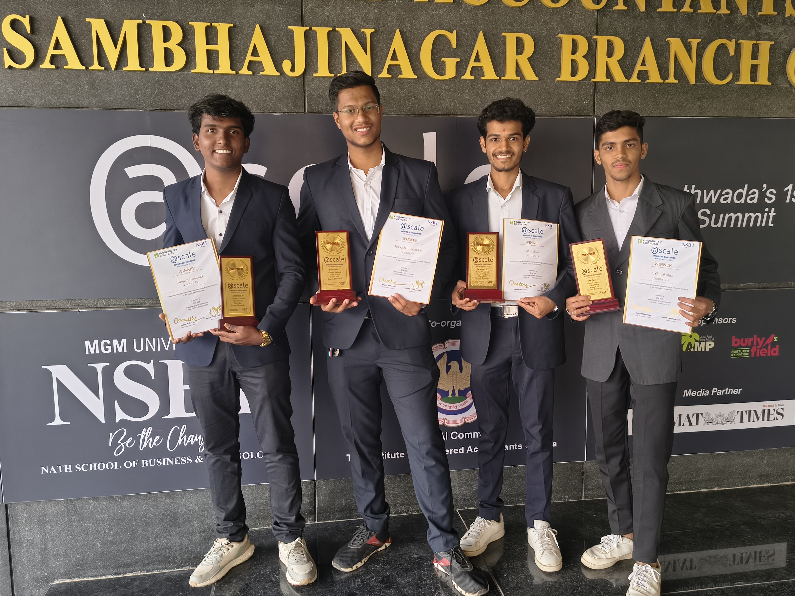
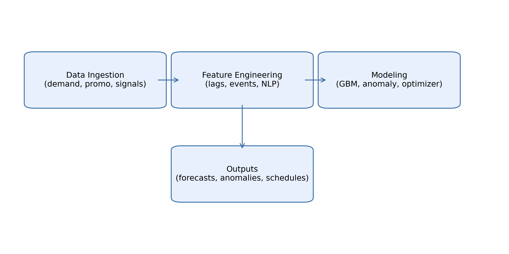
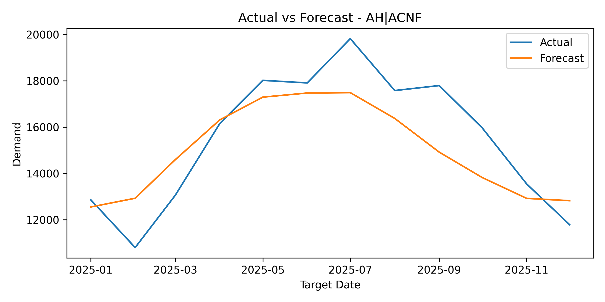
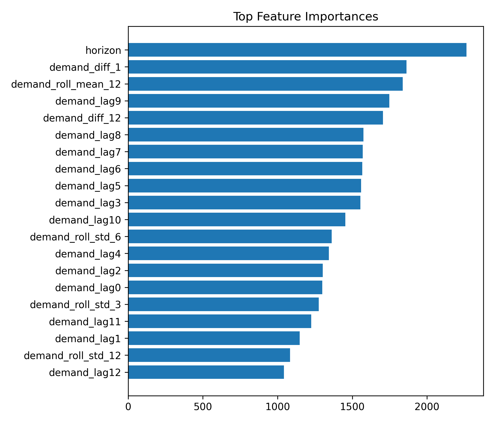
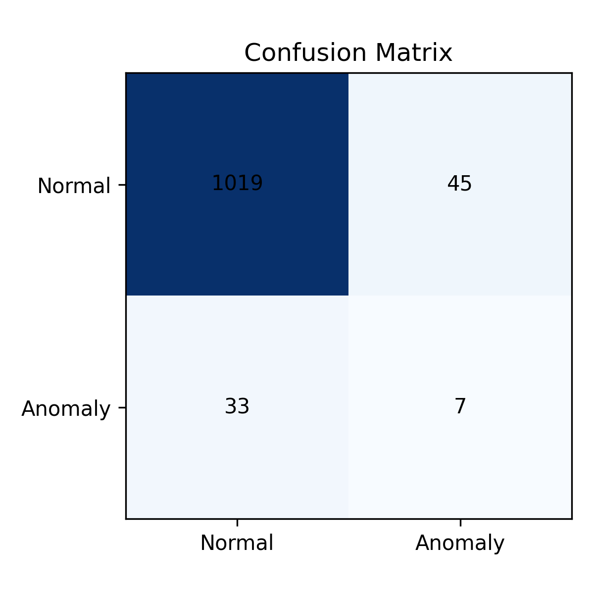
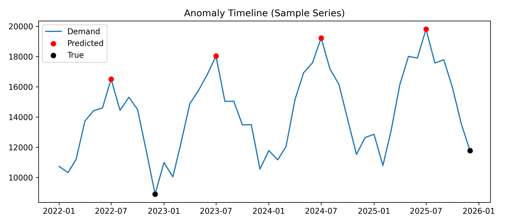
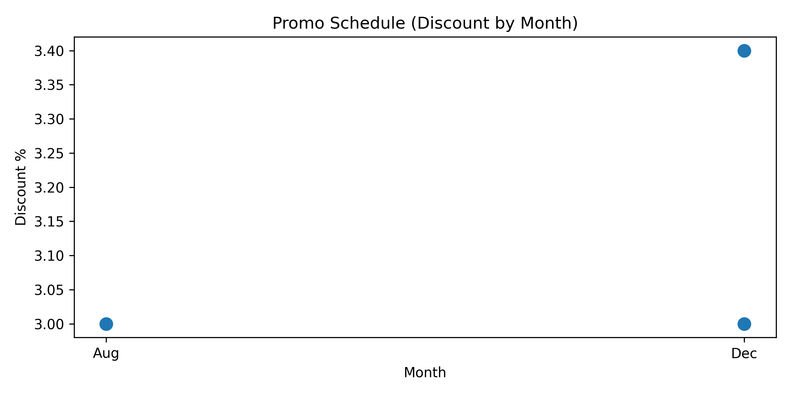
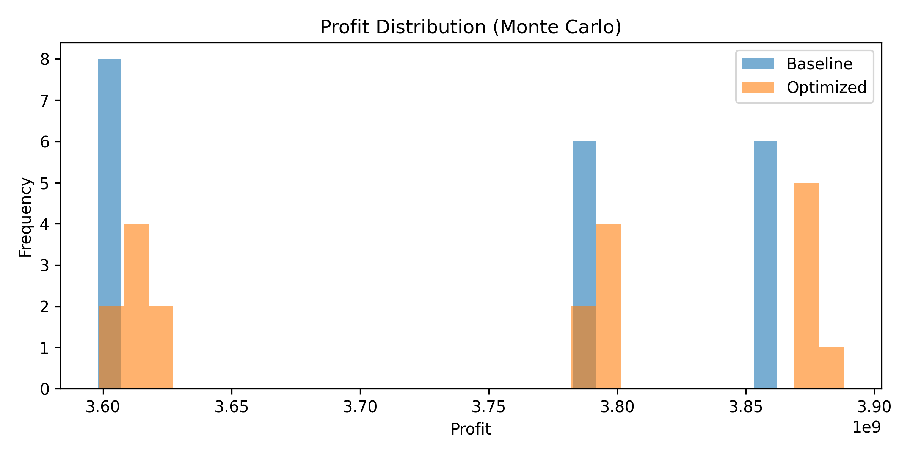
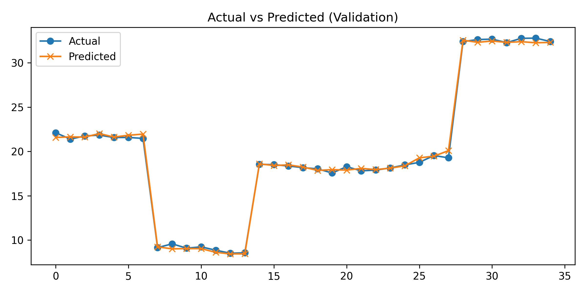
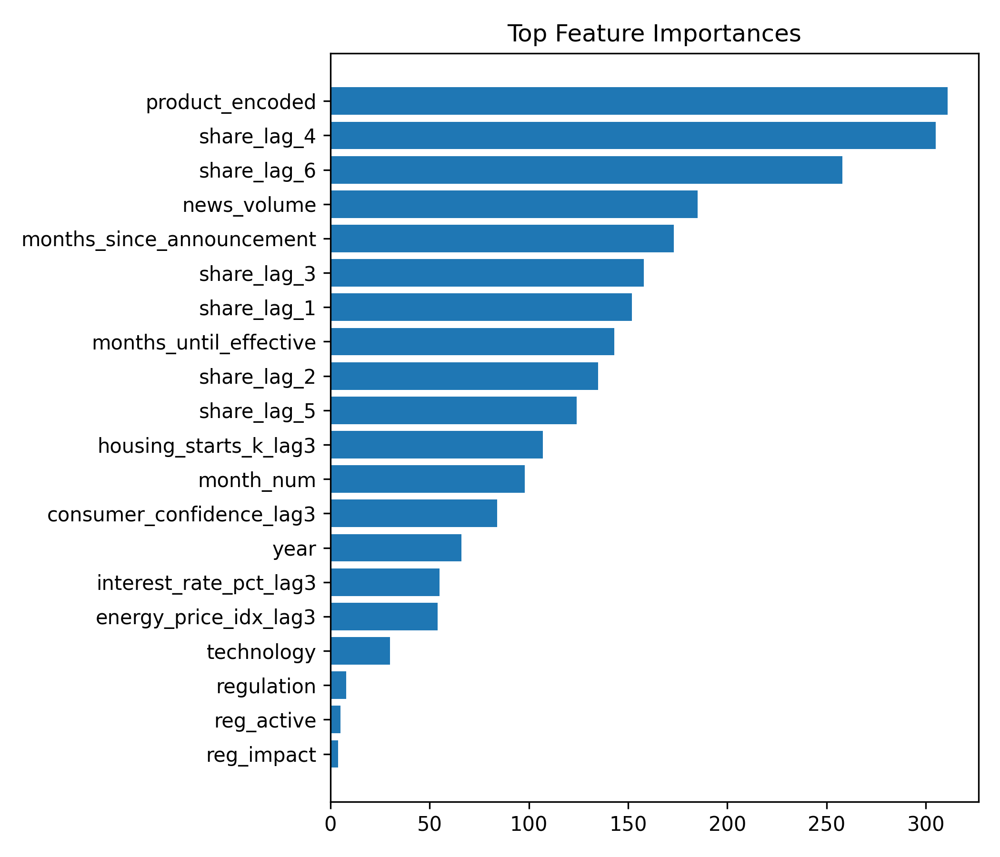

<p align="center">
  
  
</p>

<h1 align="center">AURA AI — HVAC Demand Intelligence Platform</h1>

<p align="center">
  <strong>Winning solution in Applied AI Challenge for the HVAC Demand Intelligence at <a href="https://atscale.in/">@Scale Applied AI Summit 2026</a></strong><br/>
  <em>Organized by Findability Sciences | Team SentinelX</em>
</p>

<p align="center">
  
  
  
  
  
  
</p>

<p align="center">
  
</p>

---

## Challenge Overview

The **HVAC Demand Intelligence Challenge** required building ML/AI solutions for 4 interconnected problems in HVAC manufacturing supply chain planning, using real-world inspired data from an HVAC manufacturer. 

**Event:** [@Scale Applied AI Summit 2026](https://atscale.in/) by Findability Sciences
**Domain:** HVAC Manufacturing / Supply Chain Planning
**Team Size:** 4 members
**Duration:** Hackathon format

---

## Results Summary

| Problem | Task | Key Metric | Score |
|:--------|:-----|:-----------|:------|
| **PS1** | Demand Forecasting | MAPE | **8.4%** (Strong: 5-8% tier) |
| **PS2** | Anomaly Detection | Unsupervised detection | Detects spikes, drops, pattern shifts, trend breaks |
| **PS3** | Event Impact Optimization | Profit uplift | **$13M** avg uplift (95% probability positive) |
| **PS4** | Market Share Intelligence | RMSE | **0.30** (< 1.5% tier) |

---

## Architecture

<p align="center">
  
</p>

The platform combines 4 ML pipelines feeding into a unified FastAPI + React dashboard for interactive exploration of forecasts, anomalies, optimization schedules, and market intelligence.

---

## Problem 1: Demand Forecasting with External Signals

**Task:** Predict monthly HVAC demand by product category, incorporating weather, housing, and economic signals beyond historical sales.

**Approach:**
- LightGBM with 93 engineered features (lag, rolling, cyclical, CDD, external signals)
- Walk-forward cross-validation (no data leakage)
- 12-month rolling forecasts with confidence intervals
- Backtesting against seasonal naive, moving average, trend+seasonality baselines

**Results:** 8.4% MAPE on holdout set

<p align="center">
  
  
</p>

---

## Problem 2: Anomaly Detection in Sales Patterns

**Task:** Automatically detect anomalous months in HVAC sales data and classify the likely cause — demand spikes, drops, pattern shifts, or trend breaks.

**Approach:**
- Unsupervised anomaly detection across multiple product categories
- Anomaly scoring with interpretable thresholds
- Human-readable explanation generation for flagged months
- Threshold tuning methodology with F1 optimization

<p align="center">
  
  
</p>

---

## Problem 3: Event Impact Optimization

**Task:** Determine optimal timing and magnitude of promotional events to maximize annual revenue while minimizing demand volatility, under business constraints.

**Approach:**
- Causal modeling of promotion effects (pre-buy/post-buy cannibalization)
- SciPy constrained optimization with Monte Carlo uncertainty simulation
- Constraints: max 3 promos/year, no Q1 promos, supply capacity limits, variance threshold
- 20-scenario Monte Carlo for robustness analysis

**Results:**
- **$13M average profit uplift** over baseline
- **95% probability** of positive uplift
- Variance reduced from $844M to $785M (7% reduction)

<p align="center">
  
  
</p>

---

## Problem 4: Market Share Intelligence

**Task:** Combine structured market data with unstructured competitive intelligence (news, regulatory announcements) to forecast market share changes 3-6 months ahead.

**Approach:**
- NLP pipeline for competitive intelligence extraction from 240+ synthetic news articles
- Multi-modal fusion of structured (market share, economic) + unstructured (news sentiment, regulatory) data
- LightGBM prediction model with interpretable driver attribution
- Alert system for significant predicted market share changes

**Results:** 0.30 RMSE on market share prediction (< 1.5% tier)

<p align="center">
  
  
</p>

---

## Interactive Web Dashboard

A full-stack web application to visualize and interact with all 4 model outputs:

- **Forecast Explorer** — Interactive demand forecasts with confidence intervals, model selection, and date range controls
- **Anomaly Dashboard** — Timeline view of detected anomalies with severity scores and explanations
- **Optimization Planner** — Promotion schedule visualization with profit/variance trade-offs
- **Market Intelligence** — Market share predictions with driver attribution and alert feeds

### Run the Dashboard

```bash
cd webapp

# Backend
cd backend
pip install -r requirements.txt
uvicorn app.main:app --reload --port 8000

# Frontend (separate terminal)
cd webapp/frontend
npm install
npm run dev
```

Or run both together: `python webapp/run_app.py`

---

## Project Structure

```
AURA-AI-HVAC-Intelligence/
├── notebooks/
│   ├── Problem1_Demand_Forecasting_Industry_Grade.ipynb
│   ├── Problem2_Anomaly_Detection.ipynb
│   ├── Problem3_Event_Impact_Optimization_v3.ipynb
│   └── Problem4_MarketShare_NLP.ipynb
├── webapp/
│   ├── backend/                    # FastAPI inference + API
│   ├── frontend/                   # React + TypeScript + Vite
│   ├── run_app.py                  # Launch both services
│   ├── run_backend.py
│   └── run_frontend.py
├── models/                         # Trained model bundles
│   ├── demand_forecasting_model_bundle.joblib
│   ├── anomaly_model_bundle.joblib
│   ├── event_impact_optimization_models.joblib
│   └── marketshare_nlp_model_bundle.joblib
├── data/                           # Challenge datasets (12 files)
│   ├── demand_history.csv
│   ├── external_signals.csv
│   ├── market_share_history.csv
│   ├── anomaly_labels.csv
│   ├── promotion_history.csv
│   ├── capacity_constraints.csv
│   ├── unit_economics.csv
│   ├── news_corpus.json
│   └── ...
├── results/                        # Model outputs and predictions
├── reports/
│   ├── submission_report.pdf       # Full submission report
│   ├── figures/                    # All evaluation plots
│   └── tables/                     # Metrics CSVs
├── assets/
│   └── winning_photo.jpeg
├── requirements.txt
└── .gitignore
```

---

## Tech Stack

| Layer | Technology |
|:------|:-----------|
| **ML / Forecasting** | LightGBM, scikit-learn, statsmodels |
| **Optimization** | SciPy (constrained optimization), Monte Carlo simulation |
| **NLP** | TF-IDF, sentiment extraction, regulatory signal parsing |
| **Backend API** | FastAPI, Uvicorn, Pandas, NumPy |
| **Frontend** | React 18, TypeScript, Vite, Tailwind CSS, shadcn/ui, Recharts |
| **Data** | Pandas, joblib (model serialization) |

---

## Datasets

All datasets provided by Findability Sciences for the challenge:

| File | Description | Records |
|:-----|:------------|--------:|
| `demand_history.csv` | Historical demand by product/month | ~92 |
| `market_share_history.csv` | Market share by product/year | ~20 |
| `external_signals.csv` | Weather, housing, economic indicators | ~48 |
| `anomaly_labels.csv` | Expert-labeled anomalies for evaluation | ~100 |
| `promotion_history.csv` | Historical promotions with outcomes | ~80 |
| `capacity_constraints.csv` | Monthly capacity limits by product | ~240 |
| `unit_economics.csv` | Product-level economics | ~5 |
| `news_corpus.json` | Synthetic news/press releases | ~240 |
| `regulatory_timeline.csv` | EPA regulation change timeline | ~13 |

HVAC Product Categories: Air Handlers (AH), Coolers (CL), Condensing Units (CN), Furnaces (FN), Heat Pumps (HP)

---

## Team SentinelX

Built during the @Scale Applied AI Summit 2026 hackathon organized by [Findability Sciences](https://atscale.in/). 
